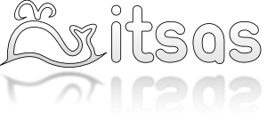

# Ongietorri | Bienvenido/a

Gizartean, jakintzaren sorkuntza eta hedapenerrako esparru naturala da unibertsitatea.
Unibertsitate publikoak konpromezu handiagoa dauka ahal bada, bera finantziatzen duen gizartearekiko.

**Itsas**-en kontsideratzen dugu software librea eta jakintzaren hedapena lotura estua dutela: ez dagoelako jakintzarik lortzerik iturburu koderik gabe, jakintza ezin delako hedatu lizentzia murriztaileekin.

  

La universidad es el ámbito natural para la difusión y generación de nuevo conocimiento en una sociedad.
La universidad pública tiene, si cabe, una mayor obligación para con la sociedad que la subvenciona.

En **itsas** consideramos que el software libre y la difusión del conocimiento están íntimamente ligados: porque no hay conocimiento sin código fuente, porque no se difunde el conocimiento usando licencias restrictivas.
